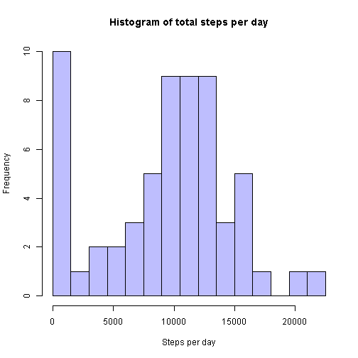
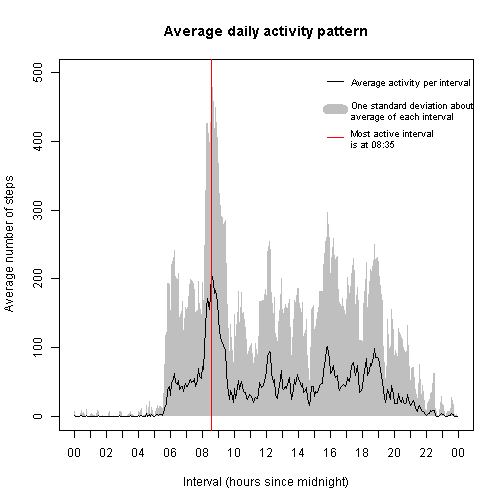
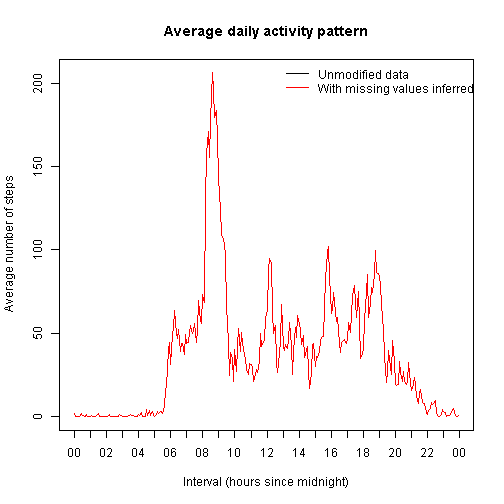
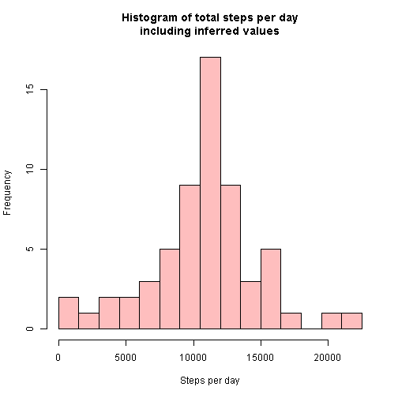
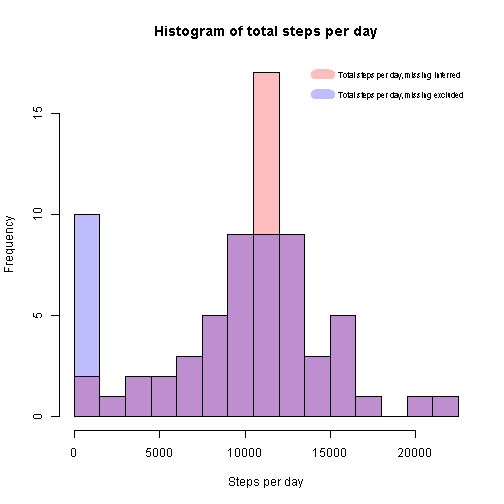
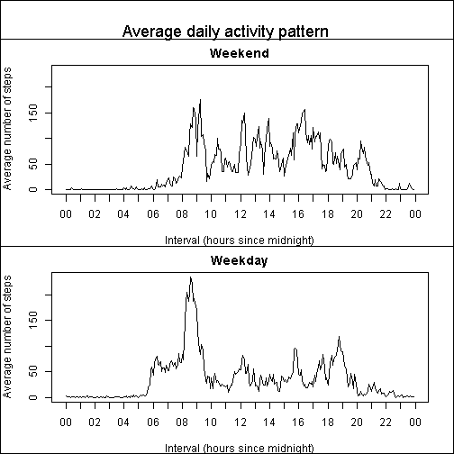
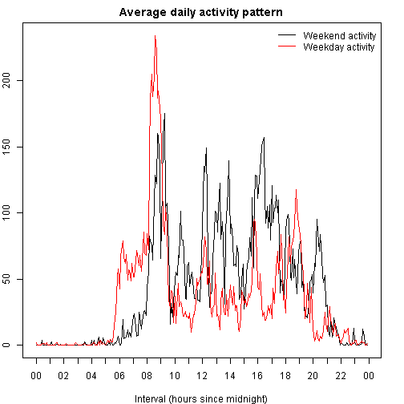

### Activity monitoring dataset

[Note to evaluators:  There are some extra plots and computations -- I was
experimenting with what sort of plot would make each aspect of the data
more clear.  Apologies also for the verbosity...]

This dataset contains a record of activity of one person, as the number of
steps taken during each 5-minute interval over the course of two months.
The recording was done using a personal activity monitoring device.

The dataset comes from:
https://github.com/rdpeng/RepData_PeerAssessment1/activity.zip

However, this may not be the raw data. The original source of the data is not
known at the moment.

Another open question is whether the times for the 5-minute intervals are in
the time zone of the person being monitored. Without this information, we
might draw incorrect conclusions about what time of day they are active.
For now, assume that the intervals are in the subject's timezone, so that
an interval numbered zero is at midnight.

### Loading and preprocessing the data

Data are provided in the archive activity.zip, which contains one file,
activity.csv.  The file contains three columns:
* steps: The number of steps in this 5-minute interval.
* date: The date of this sample.
* interval: The number of the starting hour and minute of the interval
  within the day, in the form hhmm, but with leading zeros omitted.


```r
filename <- "activity"
zipname = sprintf("%s.zip", filename)
csvname = sprintf("%s.csv", filename)

if (!file.exists(csvname)) {
    unzip(zipname, files = NULL, list = FALSE, overwrite = TRUE,
          junkpaths = FALSE, exdir = ".", unzip = "internal",
          setTimes = FALSE)
}

activity <- read.csv(csvname, na.strings="NA", colClasses=c(NA, "Date", NA))
str(activity)
```

```
## 'data.frame':	17568 obs. of  3 variables:
##  $ steps   : int  NA NA NA NA NA NA NA NA NA NA ...
##  $ date    : Date, format: "2012-10-01" "2012-10-01" ...
##  $ interval: int  0 5 10 15 20 25 30 35 40 45 ...
```

### Mean, median, and distribution of the total number of steps taken per day

First, let's examine some summary statistics and the distribution of the
total number of steps per day.  Here, we ignore missing values (some intervals
near the start and end of the data collection have no data), which will skew
the mean and show some days with very low numbers of steps.


```r
total_per_day <- tapply(activity$steps, activity$date, "sum", na.rm=TRUE)
mean_per_day <- mean(total_per_day)
median_per_day <- median(total_per_day)
print(sprintf("Mean steps per day = %f, median steps per day = %f",
              mean_per_day, median_per_day))
```

```
## [1] "Mean steps per day = 9354.229508, median steps per day = 10395.000000"
```

```r
# The max number of steps per day is a little under 21200. Use 1500 steps per
# bin, which will yield 15 bins.
steps_per_bin <- 1500
num_bins <- ceiling(max(total_per_day) / steps_per_bin)
breaks <- seq(0, num_bins * steps_per_bin, steps_per_bin)
hist(total_per_day, breaks=breaks,
     main="Histogram of total steps per day",
     xlab="Steps per day",
     col=rgb(0, 0, 1, 0.25))
```

 

### Average daily activity pattern

Next, is there a pattern of activity over the course of a day?  Average the
steps per 5-minute interval over all days.  Since we are averaging, the
intervals with missing values can simply be excluded.  This will not skew the
result unless there is a systematic loss of data on days with unusually high
or low activity, other than to increase the variance of the mean.

The interval field is not linear, as it is hour * 100 + minute, so there are
gaps, e.g. at the end of the first hour is ... 50 55 100 105 ...  In order
plot against the linear time of day, construct a time of day field, as
minutes past midnight.  Also construct a POSIXct column, in order to use
axis.POSIXct.  The date doesn't matter here, as we'll only use the hours and
minutes for axis labels, but use the actual starting date so that we can
reuse this column later for distinguishing weekdays from weekends.

Notice the clear peak in activity near 8:35am.  Notice also that activity
starts at about 6am, and is very low between about 11pm and 6am.  This is
evidence for the contention that interval zero corresponds to midnight.

Would also like to know how noisy the average per interval is.  As a crude
measure, get the standard deviation of the values in each interval, and
show a band in the plot from one standard deviation above the average, to
the greater of zero of one standard deviation below the average.  Since
the values cannot be negative, the distributions are not Gaussian, so plus
or minus one standard deviation is not the 68% confidence interval that it
would be for Gaussian data.  So this is just a proxy for an better
computation of the confidence interval, e.g. by histogramming the values
in each interval and extracting the desired quantiles.

There is a lot of variability.  But some of it may be due to variability
in the *time* at which the subject performs activities.  A short duration
activity that is repeated reliably every day, and involves the same
activity level, may nonetheless contribute to the variability, if the time
of the activity shifts by an amount large compared to its duration.


```r
# Compute the mean, slicing across the days by interval.
mean_per_interval <- tapply(activity$steps, activity$interval, "mean",
                            na.rm=TRUE)

# Also get the standard deviation, so we can show a band indicating how much
# variability there is.
sd_per_interval <- tapply(activity$steps, activity$interval, "sd",
                          na.rm=TRUE)

# Get the intervals that go along with the means -- will use this to compute
# corresponding dates.
interval_names <- names(mean_per_interval)

# Split a character interval into hours, minutes, and construct the time
# since midnight in seconds -- this is the time part of POSIXct.
# (For purposes of computing the average activity, we don't need an
# actual POSIXct value, just a relative value that has midnight at the
# correct time.  But just to avoid confusion, include the actual starting
# date.)
construct_time_of_day <- function(interval) {
    interval_value <- as.numeric(interval)
    hour <- floor(interval_value / 100)
    minute <- interval_value - hour * 100
    as.POSIXct((hour * 60 + minute) * 60, origin=activity$date[1], tz="GMT")
}

# Seconds past midnight for each interval.  Note sapply has stripped off
# the POSIXct class, so these are just numeric.
interval_seconds <- sapply(interval_names, construct_time_of_day)

# Figure out what range we want for the time axis labels, so we can use
# axis.POSIXct.
# (We have offset the interval times so they are actual POSIXct values
# for the times.  We need to re-apply as.POSIXct since sapply stripped
# the class, but since the origin is already included, use the zero
# date as origin.  Date packages in other languages do not have this
# weirdness.  But then, map / apply functions in other languages don't
# go willy-nilly stripping off classes and doing ad hoc conversions...)
time_range <- round(as.POSIXct(range(interval_seconds),
                               origin="1970-01-01 GMT",
                               tz="GMT"),
                    "hours")
# Get the rounded time range as seconds.
interval_range <- as.numeric(time_range)

# With a standard deviation above the average, the y limit needs to be
# extended.
ymax <- max(mean_per_interval + sd_per_interval)

# Start with an empty plot as we need to lay down the gray band first,
# then draw the average line over it.
plot(0, 0, xaxt="n",
     xlim=interval_range, ylim=c(0, ymax),
     xlab="Interval (hours since midnight)",
     ylab="Average number of steps",
     main="Average daily activity pattern")

axis.POSIXct(1, at=seq(time_range[1], time_range[2], by="hour"),
             format="%H")

# Draw a band at one standard deviation above and below the average,
# restricting to >= 0 on the "below" side.  This is clearly not the proper
# bounds, since the values are not Gaussian...
# Here is a nice post about using a polygon to draw a band in the base
# graphics system.
# http://stackoverflow.com/questions/14069629/plotting-confidence-intervals
polygon(
    # x coordinates, forward then back.
    c(interval_seconds, rev(interval_seconds)),
    # y coordinates, lower border, then upper border.  Note max of 0 or
    # the lower bound must be taken elementwise.  None of these are above
    # zero.
    c(sapply(mean_per_interval - sd_per_interval, function(val) {max(0, val)}),
      rev(mean_per_interval + sd_per_interval)),
    col = "grey75", border = FALSE)

# Re-draw the average line, as it's obscured by the band.  If we weren't
# reusing the above plot function, we could just get the vertical range
# and start with an empty box.  But this is a plot, not a production
# big-data computation, so waste a bit of time...
lines(interval_seconds, mean_per_interval, type="l")

# Show a line at the most active interval.
most_active_interval_idx <- which.max(mean_per_interval)
most_active_interval <- as.numeric(names(most_active_interval_idx))
most_active_interval_seconds <- construct_time_of_day(most_active_interval)
abline(v=most_active_interval_seconds, col="red")
most_active_date <- as.POSIXct(most_active_interval_seconds,
                               origin="1970-01-01 GMT",tz="GMT")
# strftime must be prevented from converting to the current timezone.
most_active_date_text <- strftime(most_active_date, format="%H:%M", tz="GMT")
most_active_legend <- sprintf("Most active interval\nis at %s",
                              most_active_date_text)

legend("topright",
       legend=c("Average activity per interval",
                "One standard deviation about\naverage of each interval",
                most_active_legend),
       lty=1, lwd=c(1, 10, 1),
       bty="n", cex=0.75, y.intersp=2,
       col=c("black", "grey75", "red"))
```

 

### Imputing missing values

There are a number of missing activity values, which may skew results.


```r
num_missing <- sum(is.na(activity$steps))
pct_missing <- (num_missing * 100) / length(activity$steps)

print(sprintf("Number of intervals with missing activity data is %d.",
              num_missing))
```

```
## [1] "Number of intervals with missing activity data is 2304."
```

```r
print(sprintf("This is %f percent of the total.", pct_missing))
```

```
## [1] "This is 13.114754 percent of the total."
```

We can attempt to infer reasonable values for the missing intervals.
Options include:

* Use the average value across days in the missing interval.
  A finer-grained substitution would be to use the average across the
  same day of the week.  This may fail if there are systematic choices
  the subject makes on which days to wear the sensor.
  
* Use the average of the adjacent or nearby intervals.  This will fail if
  the adjacent intervals are also missing, so only works if there are no
  non-missing nearby intervals.

Are there any intervals that have no data across all days?  


```r
activity$missing <- sapply(activity$steps, is.na)
missing_for_interval <- split(activity$missing, activity$interval)
all_missing_for_interval <- sapply(missing_for_interval, all)
num_all_missing_for_interval <- sum(all_missing_for_interval)
if (num_all_missing_for_interval > 0) {
    print("There are %d intervals with no data across all days.",
          num_all_missing_for_interval)
} else {
    print("All intervals have at least some data.")
}
```

```
## [1] "All intervals have at least some data."
```

Since we know that there is no interval that is missing data across all
days, but it is obvious by inspection that there are runs of many
intervals with no data, use the average value over days in the missing
interval to fill in the missing intervals.

Note:  I would rather add a column to the existing dataset with the
imputed activity values, rather than making a separate dataset that does
not preserve the original NAs.  Omitting the NAs risks that the modified
dataset will be used without knowledge that some of the data is inferred.
Nevertheless, we've been asked to make a separate dataset with the
missing values filled in.


```r
# Helper for looking up an interval in the array of average activity.
# This is much the same as the function that computes the seconds since
# midnight, except that the index is the number of 5-minute intervals
# since midnight, starting from 1 as indexing is 1-based.
interval_index <- function(interval) {
    interval_value <- as.numeric(interval)
    hour <- floor(interval_value / 100)
    minute <- interval_value - hour * 100
    1 + (hour * 60 + minute) / 5
}

# Select either the original # steps, if not NA, else the average # steps.
infer_steps <- function(index) {
    if (is.na(activity$steps[index])) {
        mean_per_interval[interval_index(activity$interval[index])]
    } else {
        activity$steps[index]
    }
}

# Make a new data frame with a steps column that has the original value
# if it's not NA, and otherwise uses the average across days.
steps_inferred <- sapply(seq_along(activity$steps), infer_steps)
activity_inferred <- data.frame(steps=steps_inferred,
                                date=activity$date,
                                interval=activity$interval)

# It's not actually a dataset unless we write it out, so do that.
csvname_inferred = sprintf("%s_inferred.csv", filename)
write.csv(activity_inferred, file=csvname_inferred,
          row.names=FALSE, quote=TRUE)
# I don't know a "simple" way to split a long string literal...
print(sprintf(paste("Modified activity dataset, with missing",
                    "steps values inferred as the average",
                    "over days for the corresponding interval",
                    "has been written to %s", sep=" "),
              csvname_inferred))
```

```
## [1] "Modified activity dataset, with missing steps values inferred as the average over days for the corresponding interval has been written to activity_inferred.csv"
```

Since we used the average activity to fill in missing values, the
average activity pattern including the missing values should be
identical to the original.  As a sanity check, show this by plotting
the original, then the inferred average activity over it -- the
inferred values exactly overlie the originals.


```r
# Compute and plot the average daily activity using the inferred data.
# (The na.rm=TRUE is a no-op here.)
mean_per_interval_inferred <- tapply(activity_inferred$steps,
                                     activity_inferred$interval,
                                     "mean", na.rm=TRUE)

# Plot the original activity pattern again, then the inferred pattern
# over it.  Note the inferred pattern completely obscures the original,
# i.e. they are identical, as expected.
plot(interval_seconds, mean_per_interval, type="l", xaxt="n",
     xlab="Interval (hours since midnight)",
     ylab="Average number of steps",
     main="Average daily activity pattern")
lines(interval_seconds, mean_per_interval_inferred, type="l", col="red")

axis.POSIXct(1, at=seq(time_range[1], time_range[2], by="hour"),
             format="%H")
legend("topright", legend=c("Unmodified data", "With missing values inferred"),
       lty=1, bty="n",
       col=c("black", "red"))
```

 

How did replacing missing values by inferred values affect the distribution of
the total number of steps per day?  Since the missing values were effectively
zero, and the inferred values may be postive, then we expect the totals per day
to go up or stay the same.  We know there were some missing values that will
be replaced by non-zero values.  Thus the mean and median should increase, and
the histogram bulk should shift right, toward larger step counts.  In
particular, since there were some days with no data or very little data, we
expect the large bar at zero counts to lose some days -- those will move to
some higher count bar.  Since the number of days is the same in both, and the
histogram bar heights are numbers of days, the area under both histograms
should stay the same.

Repeat the computation of the mean, median, and distribution of the total
steps per day, using the inferred data.  Report the change in the mean and
median, and show the two histograms overlaid on the same plot.


```r
total_per_day_inferred <- tapply(activity_inferred$steps,
                                 activity_inferred$date, "sum", na.rm=TRUE)
mean_per_day_inferred <- mean(total_per_day_inferred)
median_per_day_inferred <- median(total_per_day_inferred)
print(sprintf("Mean steps per day including inferred data = %f",
              mean_per_day_inferred))
```

```
## [1] "Mean steps per day including inferred data = 10766.188679"
```

```r
print(sprintf("Median steps per day including inferred data= %f",
              median_per_day_inferred))
```

```
## [1] "Median steps per day including inferred data= 10766.188679"
```

```r
# Use the same number of steps per bin as before.
# steps_per_bin <- 1500
num_bins_inferred <- ceiling(max(total_per_day_inferred) / steps_per_bin)
breaks_inferred <- seq(0, num_bins_inferred * steps_per_bin, steps_per_bin)
hist(total_per_day_inferred, breaks=breaks_inferred,
     main="Histogram of total steps per day\nincluding inferred values",
     xlab="Steps per day",
     col=c(rgb(1, 0, 0, 0.25)))
```

 

Compare the means and medians with and without the inferred data, and show
both histograms together.


```r
delta_mean <- mean_per_day_inferred - mean_per_day
mean_change <- "greater than"
if (delta_mean < 0) {
    mean_change <- "less than"
} else if (delta_mean == 0) {
    mean_change <- "the same as"
}
print(sprintf(paste("The mean total steps per day with the inferred data",
                    "is %s without the inferred data, by %s steps."),
              mean_change, abs(delta_mean)))
```

```
## [1] "The mean total steps per day with the inferred data is greater than without the inferred data, by 1411.95917104856 steps."
```

```r
delta_median <- median_per_day_inferred - median_per_day
median_change <- "greater than"
if (delta_median < 0) {
    median_change <- "less than"
} else if (delta_median == 0) {
    median_change <- "the same as"
}
print(sprintf(paste("The median total steps per day with the inferred data",
                    "is %s without the inferred data, by %s steps."),
              median_change, abs(delta_median)))
```

```
## [1] "The median total steps per day with the inferred data is greater than without the inferred data, by 371.188679245282 steps."
```

```r
# Plot both histograms on the same axes.  Use transparent colors so both
# show through.  Plot the inferred data first as it may use more bins, so
# it may need a longer x range.
hist(total_per_day_inferred, breaks=breaks_inferred,
     col=rgb(1, 0, 0, 0.25),
     main="Histogram of total steps per day",
     xlab="Steps per day")
hist(total_per_day, breaks=breaks,
     col=rgb(0, 0, 1, 0.25), add=TRUE)

legend("topright",
       legend=c("Total steps per day, missing inferred",
                "Total steps per day, missing excluded"),
       lty=1, lwd=c(10, 10),
       bty="n", cex=0.7, y.intersp=2,
       col=c(rgb(1, 0, 0, 0.25), rgb(0, 0, 1, 0.25)))
```

 

### Are there differences in activity patterns between weekdays and weekends?

An obvious question is, does the subject's activity differ on weekends?
Perhaps the subject engages in recreational activity on weekends, or
their activity is shifted toward later in the day...?

Add a factor column to distinguish between weekdays and weekends.

Split the data between weekdays and weekends, and repeat the computation
of the average activity pattern on each split.


```r
# Add a column to differentiate weekdays and weekends.
is_weekend <- function(date) {
    day_of_week <- as.POSIXlt(date)$wday
    day_of_week == 0 || day_of_week == 6  # Sunday or Saturday
}
activity$weekday_weekend <- factor(sapply(activity$date, is_weekend),
                                   levels=c(TRUE, FALSE),
                                   labels=c("weekend", "weekday"))

weekday_weekend <- split(activity, activity$weekday_weekend)
weekend <- weekday_weekend['weekend'][[1]]
weekday <- weekday_weekend['weekday'][[1]]
remove(weekday_weekend)

# Repeat the average daily activity computations on each split.
# (This is the same computation as earlier on the entire dataset,
# so could have defined and used this function earlier...)
compute_mean_per_interval <- function(activity_subset) {
    # Compute the mean, slicing across the days by interval.
    mean_per_interval <- tapply(activity_subset$steps,
                                activity_subset$interval,
                                "mean", na.rm=TRUE)
    # Get the intervals that go along with the means.  There is a small
    # chance that these are not the same for the two subsets, as some
    # interval might be entirely missing from one subset but not the
    # other.
    interval_names <- names(mean_per_interval)
    interval_seconds <- sapply(interval_names, construct_time_of_day)
    data.frame(mean_per_interval=mean_per_interval,
               interval_seconds=interval_seconds)
}

weekend_mean_per_interval <- compute_mean_per_interval(weekend)
weekday_mean_per_interval <- compute_mean_per_interval(weekday)
```

Plot the two patterns, one above the other.

(It would be more clear if the two plots were a little larger vertically.
I am having trouble controlling the aspect ratio of the entire plot when
the plot size is controlled by knitr.)

One can see that the subject is more uniformly active on weekends, i.e.
there is more activity during the day, and less of a large peek in the
morning.  This may indicate the subject's job does not involve physical
activity, i.e. they may be sitting at a desk during the day, but going
for a morning run.

```r
# Plot both.
# Lump the two sets of interval values together to compute the time axis
# range.
interval_range <- range(c(weekend_mean_per_interval$interval_seconds,
                          weekday_mean_per_interval$interval_seconds))
time_range <- round(as.POSIXct(interval_range,
                               origin="1970-01-01 GMT",
                               tz="GMT"),
                    "hours")
# The maximum activity is not the same for weekdays as weekends, so get the
# max of both for the y axis limit.
ymax <- max(max(weekend_mean_per_interval$mean_per_interval),
            max(weekday_mean_per_interval$mean_per_interval))

# Plot them in separate panels, one above the other.
# (Yes, I know this code is not DRY.  Could use tapply for this plot without
# separating the two subsets.  But also want to show them superimposed, where
# the two plotting functions called are not the same.)
par(mfrow=c(2, 1), mar=c(4, 4, 2, 2), oma=c(0, 0, 3, 0))
plot(weekend_mean_per_interval$interval_seconds,
     weekend_mean_per_interval$mean_per_interval,
     type="l", xaxt="n", ylim=c(0, ymax),
     xlab="Interval (hours since midnight)",
     ylab="Average number of steps",
     main="Weekend")
axis.POSIXct(1, at=seq(time_range[1], time_range[2], by="hour"),
             format="%H")
box(which="figure", lty="solid")
plot(weekday_mean_per_interval$interval_seconds,
     weekday_mean_per_interval$mean_per_interval,
     type="l", xaxt="n", ylim=c(0, ymax),
     xlab="Interval (hours since midnight)",
     ylab="Average number of steps",
     main="Weekday")
axis.POSIXct(1, at=seq(time_range[1], time_range[2], by="hour"),
             format="%H")
box(which="figure", lty="solid")
box(which="outer", lty="solid")

mtext("Average daily activity pattern", outer=TRUE, cex=1.5)
```

 

It may show the difference more clearly to superimpose the two patterns.


```r
# Would prefer to plot them superimposed -- it's easier to see how they differ.
par(mfrow=c(1, 1), mar=c(4, 2, 2, 2), oma=c(0, 0, 0, 0))
plot(weekend_mean_per_interval$interval_seconds,
     weekend_mean_per_interval$mean_per_interval,
     type="l", xaxt="n", ylim=c(0, ymax),
     xlab="Interval (hours since midnight)",
     ylab="Average number of steps",
     main="Average daily activity pattern")
lines(weekday_mean_per_interval$interval_seconds,
      weekday_mean_per_interval$mean_per_interval,
      type="l", col="red")

axis.POSIXct(1, at=seq(time_range[1], time_range[2], by="hour"),
             format="%H")

legend("topright", legend=c("Weekend activity", "Weekday activity"),
       lty=1, bty="n",
       col=c("black", "red"))
```

 
